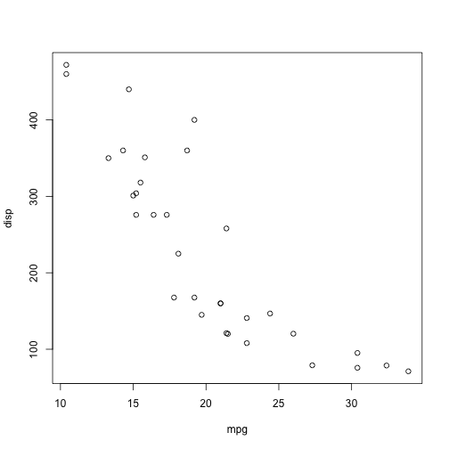
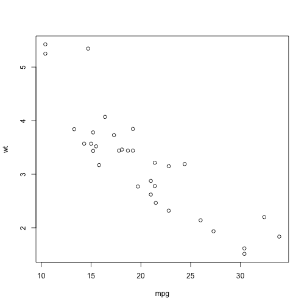
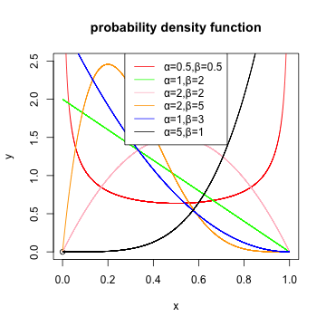
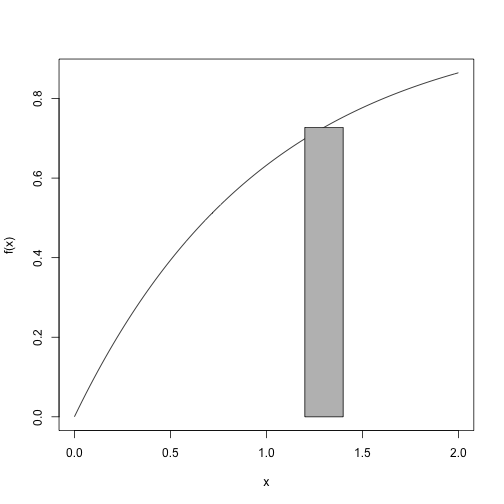
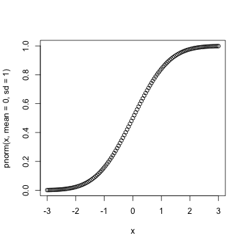
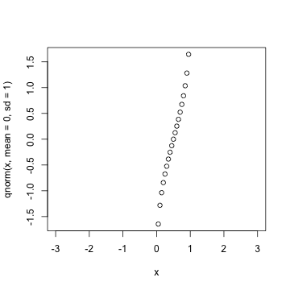
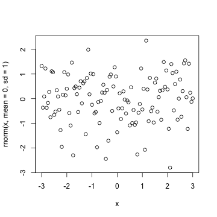

## 一、help

获取注解

* 获取某个功能（function）的具体使用

```r
?mean
```

* 获取某个短语，文件，或者词组的具体解释

```r
help.search('weighted mean')
```

* 获取某个R包的具体使用

```r
help(package = 'dplyr')
```

* 获取某个变量的属性

```r
str(iris)
class(iris)
```

## 二、包的使用


```r
## 包的安装
install.packages("ggplot2")
## 包的使用
library(ggplot2)
## 包内具体功能的使用
dplyr::select
## 导入数据
data(iris)
```

## 三、工作目录


```r
## 获取目录
getwd()
## 更改目录
setwd(dir = "./")
```


## 四、数据结构

### 1.向量（Vector）

#### 创建
|函数             |变量         |描述             |
|:----------------|:------------|:----------------|
| c(2,4,6)        | 2 4 6       | 新建向量        |
| 2:6             | 2 3 4 5 6   | 有序连续整数向量|
| seq(2,3,by=0.5) | 2.0 2.5 3.0 | 指定间隔向量    |
| rep(1:2,times=3 | 1 2 1 2 1 2 | 向量重复        |
| rep(1:2,each=3) | 1 1 1 2 2 2 | 向量元素重复    |

#### 选择

```r
x <- 1:10
# 按位置选择元素
x[4]
## [1] 4
x[2:4]
## [1] 2 3 4
# 按位置去除元素
x[-4]
## [1]  1  2  3  5  6  7  8  9 10
x[-(2:4)] ## 不包含第二到第四
## [1]  1  5  6  7  8  9 10
x[c(1,5)] ## 不包含第一和第五
## [1] 1 5
# 选择特定值的元素
x[x==10]
## [1] 10
x[x<0]
## integer(0)
subset(x,x>5)
## [1]  6  7  8  9 10
x[x %in% c(1,2,5)]
## [1] 1 2 5
# 选择特定名称的元素
x['apple']
## [1] NA
```

#### 基本功能

```r
x <- c(1,3,2,4,5,5,6,8,9,10)
x1 <- rep(1:2,times = 5)
sort(x) ## 排序
##  [1]  1  2  3  4  5  5  6  8  9 10
rev(x) ## 翻转
##  [1] 10  9  8  6  5  5  4  2  3  1
table(x) ## 查看每个元素的数目
## x
##  1  2  3  4  5  6  8  9 10 
##  1  1  1  1  2  1  1  1  1
unique(x) ## 去重复
## [1]  1  3  2  4  5  6  8  9 10
x + x1 ## 加
##  [1]  2  5  3  6  6  7  7 10 10 12
x - x1 ## 减
##  [1] 0 1 1 2 4 3 5 6 8 8
x * x1 ## 乘
##  [1]  1  6  2  8  5 10  6 16  9 20
x / x1 ## 除
##  [1] 1.0 1.5 2.0 2.0 5.0 2.5 6.0 4.0 9.0 5.0
all(x > 0) ## 判断是否都满足
## [1] TRUE
any(x < 8) ## 判断是否有一个满足
## [1] TRUE
```

#### 基本函数

```r
sum(x) ## 求和
## [1] 53
mean(x) ## 平均值
## [1] 5.3
median(x) ## 中值
## [1] 5
quantile(x) ## 分位数
##    0%   25%   50%   75%  100% 
##  1.00  3.25  5.00  7.50 10.00
rank(x) ## 排序index
##  [1]  1.0  3.0  2.0  4.0  5.5  5.5  7.0  8.0  9.0 10.0
var(x) ## 方差
## [1] 8.9
sd(x) ## 标准差
## [1] 2.983287
cumsum(x) ## 按项递加求和
##  [1]  1  4  6 10 15 20 26 34 43 53
log(x) ## log 以e为底
##  [1] 0.0000000 1.0986123 0.6931472 1.3862944 1.6094379 1.6094379 1.7917595 2.0794415 2.1972246 2.3025851
exp(x) ## 指数 以e为底
##  [1]     2.718282    20.085537     7.389056    54.598150   148.413159   148.413159   403.428793  2980.957987  8103.083928
## [10] 22026.465795
max(x)
## [1] 10
min(x)
## [1] 1
q <- c(1.2214,1.3324,1.4423)
round(q,3) ## 保留位数
## [1] 1.221 1.332 1.442
signif(q,2) ## 精确度
## [1] 1.2 1.3 1.4
y <- rev(x)
cor(x,y) ## 相关性
## [1] -0.9600499
```

### 2.矩阵和数组

#### 创建

* 矩阵

```r
c <- seq(1,9)
namerow <- c("R1","R2","R3")
namecol <- c("C1","C2","C3")
m <- matrix(c,nrow=3,ncol=3,byrow = TRUE,dimnames = list(namerow,namecol))
m
##    C1 C2 C3
## R1  1  2  3
## R2  4  5  6
## R3  7  8  9
## nrow 行数 ncol 列数 byrow 按行填充还是按列填充，dimnames（行列名）
```

* 数组

```r
## myarray <- array(vector,dimension,dimnames)
dim1 <- c("A1","A2")
dim2 <- c("B1","B2","B3")
dim3 <- c("C1","C2","C3","C4")
z <- array(1:24,c(2,3,4),dimnames = list(dim1,dim2,dim3))
z
## , , C1
## 
##    B1 B2 B3
## A1  1  3  5
## A2  2  4  6
## 
## , , C2
## 
##    B1 B2 B3
## A1  7  9 11
## A2  8 10 12
## 
## , , C3
## 
##    B1 B2 B3
## A1 13 15 17
## A2 14 16 18
## 
## , , C4
## 
##    B1 B2 B3
## A1 19 21 23
## A2 20 22 24
```

#### 对矩阵的行和列调用函数

apply(m,dimcode,f,fargs)

* m代表矩阵
* dimcode代表维度编号，1代表对每一行应用函数，2代表对每一列应用函数
* f使用的函数运算(循环补齐)
* fargs f函数可调用的参数


```r
z <- matrix(1:6,nrow=3,ncol=2)
z
##      [,1] [,2]
## [1,]    1    4
## [2,]    2    5
## [3,]    3    6
apply(z,1,mean)
## [1] 2.5 3.5 4.5
f<- function(x) {x/c(2,8)}
apply(z,2,f)
## Warning in x/c(2, 8): longer object length is not a multiple of shorter object length

## Warning in x/c(2, 8): longer object length is not a multiple of shorter object length
##      [,1]  [,2]
## [1,] 0.50 2.000
## [2,] 0.25 0.625
## [3,] 1.50 3.000
```

#### 矩阵的组合

```r
cbind(1,z) ## 行不变，列增加
##      [,1] [,2] [,3]
## [1,]    1    1    4
## [2,]    1    2    5
## [3,]    1    3    6
rbind(1,z) ## 列不变，行增加
##      [,1] [,2]
## [1,]    1    1
## [2,]    1    4
## [3,]    2    5
## [4,]    3    6
```

### 3.列表

#### 创建

```r
j <- list(name="Joe",salary = 55000,union=T)
j
## $name
## [1] "Joe"
## 
## $salary
## [1] 55000
## 
## $union
## [1] TRUE
```

#### 常用操作

```r
## 索引
j$salary
j[1]
## 增删
j$age <- 45
j$union <- NULL
## 访问元素
unlist(j)
```

### 4.数据框

#### 创建

mydata <- data.frame(col1,col2,col3)

```r
patientID <- c(1,2,3,4)
age <- c(25,34,28,51)
diabetes <- c("Type1","Type2","Type1","Type1")
status <- c("Poor","Improved","Excellent","Poor")
patientData <- data.frame(patientID,age,diabetes,status)
patientData
##   patientID age diabetes    status
## 1         1  25    Type1      Poor
## 2         2  34    Type2  Improved
## 3         3  28    Type1 Excellent
## 4         4  51    Type1      Poor
```

#### 基本操作

* attach() 添加到R的搜索路径中
* detach() 从搜索路径中解除
* with()

```r
attach(mtcars)
## The following object is masked from package:ggplot2:
## 
##     mpg
  summary(mpg)
##    Min. 1st Qu.  Median    Mean 3rd Qu.    Max. 
##   10.40   15.43   19.20   20.09   22.80   33.90
  plot(mpg,disp)
```



```r
  plot(mpg,wt)
```



```r
detach(mtcars)
```

类似于矩阵的操作
* cbind()
* rbind()
* dim()
* subset()
* apply()

#### 数据框的合并
merge()

merge(x, y, by = intersect(names(x), names(y)),
      by.x = by, by.y = by, all = FALSE, all.x = all, all.y = all,
      sort = TRUE, suffixes = c(".x",".y"), no.dups = TRUE,
      incomparables = NULL, ...)
      

```r
d1 <- data.frame(kids=c("Jack","Jill","Jillian","John"),states = c("CA","MA","MA","HI"))
d1
##      kids states
## 1    Jack     CA
## 2    Jill     MA
## 3 Jillian     MA
## 4    John     HI
d2 <- data.frame(ages=c(10,7,12),kids=c("Jill","Lillian","Jack"))
d2
##   ages    kids
## 1   10    Jill
## 2    7 Lillian
## 3   12    Jack
merge(d1,d2)
##   kids states ages
## 1 Jack     CA   12
## 2 Jill     MA   10
merge(d1,d2,by.x="kids")
##   kids states ages
## 1 Jack     CA   12
## 2 Jill     MA   10
merge(d1,d2,by.y = "ages")
## [1] kids   states kids.y
## <0 rows> (or 0-length row.names)
merge(d1,d2,all=T)
##      kids states ages
## 1    Jack     CA   12
## 2    Jill     MA   10
## 3 Jillian     MA   NA
## 4    John     HI   NA
## 5 Lillian   <NA>    7
```

### 5.因子


```r
status
## [1] "Poor"      "Improved"  "Excellent" "Poor"
factor(status)
## [1] Poor      Improved  Excellent Poor     
## Levels: Excellent Improved Poor
factor(status,ordered=TRUE,levels = c("Poor","Improved","Excellent"))
## [1] Poor      Improved  Excellent Poor     
## Levels: Poor < Improved < Excellent
```

#### tapply

和apply类似，分组使用了因子的不同水平为标准

```r
ages <- c(25,26,55,37,21,42)
affils <- c("R","D","D","R","U","D")
tapply(ages,affils,mean)
##  D  R  U 
## 41 31 21
```

### 6.String

x <- c("I","M")

y <- c("P","C")

|Strings                    |results              |
|:--------------------------|:--------------------|
|paste(x,y,sep =' ')        |"I P" "M C"          |
|paste(x,collapse=' ')      |"I M"                |
|grep("M",x)                |2                    |
|gsub("M","A",x)            |"I" "A"              |
|toupper(x)                 |"I" "M"              |
|tolower(x)                 |"i" "m"              |
|nchar(x)                   |1 1                  |

## 五、其他数据操作

### 1.缺失值的管理

```r
y <- c(1,2,3,NA)
is.na(y) ## 判断缺失值
## [1] FALSE FALSE FALSE  TRUE
sum(y,na.rm = T) ## 排除缺失值
## [1] 6
leadership <- data.frame(manager=c(1,2,3,4,5),gender = c("M","F","F","M","F"),q1=c(5,2,3,NA,1),q2=c(1,2,NA,3,4))
na.omit(leadership) ## 删除不完整的观测，数据框中删除带有NA的行
##   manager gender q1 q2
## 1       1      M  5  1
## 2       2      F  2  2
## 5       5      F  1  4
```

### 2.概率函数

|分布名称                |缩写                          |
|:=======================|:=============================|
|Beta分布|beta|
|二项分布|binom|
|柯西分布|cauchy|
|(非中心)卡方分布|chisq|
|指数分布|exp|
|F分布|f|
|Gamma分布|gamma|
|几何分布|geom|
|超几何分布|hyper|
|对数正态分布|lnorm|
|Logistic分布|logis|
|多项分布|multinom|
|负二项分布|nbinom|
|正态分布|norm|
|泊松分布|pois|
|Wilcoxon符号秩分布|signrank|
|t分布|t|
|均匀分布|unif|
|Weibull分布|weibull|
|Wilcoxon秩和分布|wilcox|


```r
x<-seq(0,1,length.out=10000)
plot(0,0,main='probability density function',xlim=c(0,1),ylim=c(0,2.5),ylab='y',xlab = 'x')
lines(x,dbeta(x,0.5,0.5),col='red')
lines(x,dbeta(x,1,2),col='green')
lines(x,dbeta(x,2,2),col='pink')
lines(x,dbeta(x,2,5),col='orange')
lines(x,dbeta(x,1,3),col='blue')
lines(x,dbeta(x,5,1),col='black')
legend('top',legend=c('α=0.5,β=0.5','α=1,β=2','α=2,β=2','α=2,β=5','α=1,β=3','α=5,β=1'),col=c('red','green','pink','orange','blue','black'),lwd=1)
```



* dnorm() 密度分布
* pnorm() 分布函数
* qnorm() 分位数函数
* rnorm() 生成随机数


```r
x <- pretty(c(-3,3),100) ## 生成符合标准正态分布的随机数
plot(x,dnorm(x,mean = 0,sd = 1))
```



```r
plot(x,pnorm(x,mean = 0,sd = 1))
```



```r
plot(x,qnorm(x,mean = 0,sd = 1))
```



```r
plot(x,rnorm(x,mean = 0,sd = 1))
```



### 3.控制流

* for循环
    for (var in seq) statment
* while
    while (cond) statement
* if-else
    if(cond) statement1
    else statement2
* 自编函数
    myfunction <- function(arg1,arg2, ... ){
        statements
        return(object)
    }

### 4.reshape2包

#### 融合

```r
library(reshape2)
## 
## Attaching package: 'reshape2'
## The following object is masked from 'package:tidyr':
## 
##     smiths
mydata <- data.frame(ID = c(1,1,2,2),Time=c(1,2,1,2),X1=c(5,3,6,2),X2=c(6,5,1,4))
mydata
##   ID Time X1 X2
## 1  1    1  5  6
## 2  1    2  3  5
## 3  2    1  6  1
## 4  2    2  2  4
md <- melt(mydata,id=c("ID","Time"))
md
##   ID Time variable value
## 1  1    1       X1     5
## 2  1    2       X1     3
## 3  2    1       X1     6
## 4  2    2       X1     2
## 5  1    1       X2     6
## 6  1    2       X2     5
## 7  2    1       X2     1
## 8  2    2       X2     4
```

#### 重铸

```r
library(reshape2)
names(airquality) <- tolower(names(airquality))
airquality
##     ozone solar.r wind temp month day
## 1      41     190  7.4   67     5   1
## 2      36     118  8.0   72     5   2
## 3      12     149 12.6   74     5   3
## 4      18     313 11.5   62     5   4
## 5      NA      NA 14.3   56     5   5
## 6      28      NA 14.9   66     5   6
## 7      23     299  8.6   65     5   7
## 8      19      99 13.8   59     5   8
## 9       8      19 20.1   61     5   9
## 10     NA     194  8.6   69     5  10
## 11      7      NA  6.9   74     5  11
## 12     16     256  9.7   69     5  12
## 13     11     290  9.2   66     5  13
## 14     14     274 10.9   68     5  14
## 15     18      65 13.2   58     5  15
## 16     14     334 11.5   64     5  16
## 17     34     307 12.0   66     5  17
## 18      6      78 18.4   57     5  18
## 19     30     322 11.5   68     5  19
## 20     11      44  9.7   62     5  20
## 21      1       8  9.7   59     5  21
## 22     11     320 16.6   73     5  22
## 23      4      25  9.7   61     5  23
## 24     32      92 12.0   61     5  24
## 25     NA      66 16.6   57     5  25
## 26     NA     266 14.9   58     5  26
## 27     NA      NA  8.0   57     5  27
## 28     23      13 12.0   67     5  28
## 29     45     252 14.9   81     5  29
## 30    115     223  5.7   79     5  30
## 31     37     279  7.4   76     5  31
## 32     NA     286  8.6   78     6   1
## 33     NA     287  9.7   74     6   2
## 34     NA     242 16.1   67     6   3
## 35     NA     186  9.2   84     6   4
## 36     NA     220  8.6   85     6   5
## 37     NA     264 14.3   79     6   6
## 38     29     127  9.7   82     6   7
## 39     NA     273  6.9   87     6   8
## 40     71     291 13.8   90     6   9
## 41     39     323 11.5   87     6  10
## 42     NA     259 10.9   93     6  11
## 43     NA     250  9.2   92     6  12
## 44     23     148  8.0   82     6  13
## 45     NA     332 13.8   80     6  14
## 46     NA     322 11.5   79     6  15
## 47     21     191 14.9   77     6  16
## 48     37     284 20.7   72     6  17
## 49     20      37  9.2   65     6  18
## 50     12     120 11.5   73     6  19
## 51     13     137 10.3   76     6  20
## 52     NA     150  6.3   77     6  21
## 53     NA      59  1.7   76     6  22
## 54     NA      91  4.6   76     6  23
## 55     NA     250  6.3   76     6  24
## 56     NA     135  8.0   75     6  25
## 57     NA     127  8.0   78     6  26
## 58     NA      47 10.3   73     6  27
## 59     NA      98 11.5   80     6  28
## 60     NA      31 14.9   77     6  29
## 61     NA     138  8.0   83     6  30
## 62    135     269  4.1   84     7   1
## 63     49     248  9.2   85     7   2
## 64     32     236  9.2   81     7   3
## 65     NA     101 10.9   84     7   4
## 66     64     175  4.6   83     7   5
## 67     40     314 10.9   83     7   6
## 68     77     276  5.1   88     7   7
## 69     97     267  6.3   92     7   8
## 70     97     272  5.7   92     7   9
## 71     85     175  7.4   89     7  10
## 72     NA     139  8.6   82     7  11
## 73     10     264 14.3   73     7  12
## 74     27     175 14.9   81     7  13
## 75     NA     291 14.9   91     7  14
## 76      7      48 14.3   80     7  15
## 77     48     260  6.9   81     7  16
## 78     35     274 10.3   82     7  17
## 79     61     285  6.3   84     7  18
## 80     79     187  5.1   87     7  19
## 81     63     220 11.5   85     7  20
## 82     16       7  6.9   74     7  21
## 83     NA     258  9.7   81     7  22
## 84     NA     295 11.5   82     7  23
## 85     80     294  8.6   86     7  24
## 86    108     223  8.0   85     7  25
## 87     20      81  8.6   82     7  26
## 88     52      82 12.0   86     7  27
## 89     82     213  7.4   88     7  28
## 90     50     275  7.4   86     7  29
## 91     64     253  7.4   83     7  30
## 92     59     254  9.2   81     7  31
## 93     39      83  6.9   81     8   1
## 94      9      24 13.8   81     8   2
## 95     16      77  7.4   82     8   3
## 96     78      NA  6.9   86     8   4
## 97     35      NA  7.4   85     8   5
## 98     66      NA  4.6   87     8   6
## 99    122     255  4.0   89     8   7
## 100    89     229 10.3   90     8   8
## 101   110     207  8.0   90     8   9
## 102    NA     222  8.6   92     8  10
## 103    NA     137 11.5   86     8  11
## 104    44     192 11.5   86     8  12
## 105    28     273 11.5   82     8  13
## 106    65     157  9.7   80     8  14
## 107    NA      64 11.5   79     8  15
## 108    22      71 10.3   77     8  16
## 109    59      51  6.3   79     8  17
## 110    23     115  7.4   76     8  18
## 111    31     244 10.9   78     8  19
## 112    44     190 10.3   78     8  20
## 113    21     259 15.5   77     8  21
## 114     9      36 14.3   72     8  22
## 115    NA     255 12.6   75     8  23
## 116    45     212  9.7   79     8  24
## 117   168     238  3.4   81     8  25
## 118    73     215  8.0   86     8  26
## 119    NA     153  5.7   88     8  27
## 120    76     203  9.7   97     8  28
## 121   118     225  2.3   94     8  29
## 122    84     237  6.3   96     8  30
## 123    85     188  6.3   94     8  31
## 124    96     167  6.9   91     9   1
## 125    78     197  5.1   92     9   2
## 126    73     183  2.8   93     9   3
## 127    91     189  4.6   93     9   4
## 128    47      95  7.4   87     9   5
## 129    32      92 15.5   84     9   6
## 130    20     252 10.9   80     9   7
## 131    23     220 10.3   78     9   8
## 132    21     230 10.9   75     9   9
## 133    24     259  9.7   73     9  10
## 134    44     236 14.9   81     9  11
## 135    21     259 15.5   76     9  12
## 136    28     238  6.3   77     9  13
## 137     9      24 10.9   71     9  14
## 138    13     112 11.5   71     9  15
## 139    46     237  6.9   78     9  16
## 140    18     224 13.8   67     9  17
## 141    13      27 10.3   76     9  18
## 142    24     238 10.3   68     9  19
## 143    16     201  8.0   82     9  20
## 144    13     238 12.6   64     9  21
## 145    23      14  9.2   71     9  22
## 146    36     139 10.3   81     9  23
## 147     7      49 10.3   69     9  24
## 148    14      20 16.6   63     9  25
## 149    30     193  6.9   70     9  26
## 150    NA     145 13.2   77     9  27
## 151    14     191 14.3   75     9  28
## 152    18     131  8.0   76     9  29
## 153    20     223 11.5   68     9  30
aqm <- melt(airquality, id=c("month", "day"), na.rm=TRUE)
aqm
##     month day variable value
## 1       5   1    ozone  41.0
## 2       5   2    ozone  36.0
## 3       5   3    ozone  12.0
## 4       5   4    ozone  18.0
## 6       5   6    ozone  28.0
## 7       5   7    ozone  23.0
## 8       5   8    ozone  19.0
## 9       5   9    ozone   8.0
## 11      5  11    ozone   7.0
## 12      5  12    ozone  16.0
## 13      5  13    ozone  11.0
## 14      5  14    ozone  14.0
## 15      5  15    ozone  18.0
## 16      5  16    ozone  14.0
## 17      5  17    ozone  34.0
## 18      5  18    ozone   6.0
## 19      5  19    ozone  30.0
## 20      5  20    ozone  11.0
## 21      5  21    ozone   1.0
## 22      5  22    ozone  11.0
## 23      5  23    ozone   4.0
## 24      5  24    ozone  32.0
## 28      5  28    ozone  23.0
## 29      5  29    ozone  45.0
## 30      5  30    ozone 115.0
## 31      5  31    ozone  37.0
## 38      6   7    ozone  29.0
## 40      6   9    ozone  71.0
## 41      6  10    ozone  39.0
## 44      6  13    ozone  23.0
## 47      6  16    ozone  21.0
## 48      6  17    ozone  37.0
## 49      6  18    ozone  20.0
## 50      6  19    ozone  12.0
## 51      6  20    ozone  13.0
## 62      7   1    ozone 135.0
## 63      7   2    ozone  49.0
## 64      7   3    ozone  32.0
## 66      7   5    ozone  64.0
## 67      7   6    ozone  40.0
## 68      7   7    ozone  77.0
## 69      7   8    ozone  97.0
## 70      7   9    ozone  97.0
## 71      7  10    ozone  85.0
## 73      7  12    ozone  10.0
## 74      7  13    ozone  27.0
## 76      7  15    ozone   7.0
## 77      7  16    ozone  48.0
## 78      7  17    ozone  35.0
## 79      7  18    ozone  61.0
## 80      7  19    ozone  79.0
## 81      7  20    ozone  63.0
## 82      7  21    ozone  16.0
## 85      7  24    ozone  80.0
## 86      7  25    ozone 108.0
## 87      7  26    ozone  20.0
## 88      7  27    ozone  52.0
## 89      7  28    ozone  82.0
## 90      7  29    ozone  50.0
## 91      7  30    ozone  64.0
## 92      7  31    ozone  59.0
## 93      8   1    ozone  39.0
## 94      8   2    ozone   9.0
## 95      8   3    ozone  16.0
## 96      8   4    ozone  78.0
## 97      8   5    ozone  35.0
## 98      8   6    ozone  66.0
## 99      8   7    ozone 122.0
## 100     8   8    ozone  89.0
## 101     8   9    ozone 110.0
## 104     8  12    ozone  44.0
## 105     8  13    ozone  28.0
## 106     8  14    ozone  65.0
## 108     8  16    ozone  22.0
## 109     8  17    ozone  59.0
## 110     8  18    ozone  23.0
## 111     8  19    ozone  31.0
## 112     8  20    ozone  44.0
## 113     8  21    ozone  21.0
## 114     8  22    ozone   9.0
## 116     8  24    ozone  45.0
## 117     8  25    ozone 168.0
## 118     8  26    ozone  73.0
## 120     8  28    ozone  76.0
## 121     8  29    ozone 118.0
## 122     8  30    ozone  84.0
## 123     8  31    ozone  85.0
## 124     9   1    ozone  96.0
## 125     9   2    ozone  78.0
## 126     9   3    ozone  73.0
## 127     9   4    ozone  91.0
## 128     9   5    ozone  47.0
## 129     9   6    ozone  32.0
## 130     9   7    ozone  20.0
## 131     9   8    ozone  23.0
## 132     9   9    ozone  21.0
## 133     9  10    ozone  24.0
## 134     9  11    ozone  44.0
## 135     9  12    ozone  21.0
## 136     9  13    ozone  28.0
## 137     9  14    ozone   9.0
## 138     9  15    ozone  13.0
## 139     9  16    ozone  46.0
## 140     9  17    ozone  18.0
## 141     9  18    ozone  13.0
## 142     9  19    ozone  24.0
## 143     9  20    ozone  16.0
## 144     9  21    ozone  13.0
## 145     9  22    ozone  23.0
## 146     9  23    ozone  36.0
## 147     9  24    ozone   7.0
## 148     9  25    ozone  14.0
## 149     9  26    ozone  30.0
## 151     9  28    ozone  14.0
## 152     9  29    ozone  18.0
## 153     9  30    ozone  20.0
## 154     5   1  solar.r 190.0
## 155     5   2  solar.r 118.0
## 156     5   3  solar.r 149.0
## 157     5   4  solar.r 313.0
## 160     5   7  solar.r 299.0
## 161     5   8  solar.r  99.0
## 162     5   9  solar.r  19.0
## 163     5  10  solar.r 194.0
## 165     5  12  solar.r 256.0
## 166     5  13  solar.r 290.0
## 167     5  14  solar.r 274.0
## 168     5  15  solar.r  65.0
## 169     5  16  solar.r 334.0
## 170     5  17  solar.r 307.0
## 171     5  18  solar.r  78.0
## 172     5  19  solar.r 322.0
## 173     5  20  solar.r  44.0
## 174     5  21  solar.r   8.0
## 175     5  22  solar.r 320.0
## 176     5  23  solar.r  25.0
## 177     5  24  solar.r  92.0
## 178     5  25  solar.r  66.0
## 179     5  26  solar.r 266.0
## 181     5  28  solar.r  13.0
## 182     5  29  solar.r 252.0
## 183     5  30  solar.r 223.0
## 184     5  31  solar.r 279.0
## 185     6   1  solar.r 286.0
## 186     6   2  solar.r 287.0
## 187     6   3  solar.r 242.0
## 188     6   4  solar.r 186.0
## 189     6   5  solar.r 220.0
## 190     6   6  solar.r 264.0
## 191     6   7  solar.r 127.0
## 192     6   8  solar.r 273.0
## 193     6   9  solar.r 291.0
## 194     6  10  solar.r 323.0
## 195     6  11  solar.r 259.0
## 196     6  12  solar.r 250.0
## 197     6  13  solar.r 148.0
## 198     6  14  solar.r 332.0
## 199     6  15  solar.r 322.0
## 200     6  16  solar.r 191.0
## 201     6  17  solar.r 284.0
## 202     6  18  solar.r  37.0
## 203     6  19  solar.r 120.0
## 204     6  20  solar.r 137.0
## 205     6  21  solar.r 150.0
## 206     6  22  solar.r  59.0
## 207     6  23  solar.r  91.0
## 208     6  24  solar.r 250.0
## 209     6  25  solar.r 135.0
## 210     6  26  solar.r 127.0
## 211     6  27  solar.r  47.0
## 212     6  28  solar.r  98.0
## 213     6  29  solar.r  31.0
## 214     6  30  solar.r 138.0
## 215     7   1  solar.r 269.0
## 216     7   2  solar.r 248.0
## 217     7   3  solar.r 236.0
## 218     7   4  solar.r 101.0
## 219     7   5  solar.r 175.0
## 220     7   6  solar.r 314.0
## 221     7   7  solar.r 276.0
## 222     7   8  solar.r 267.0
## 223     7   9  solar.r 272.0
## 224     7  10  solar.r 175.0
## 225     7  11  solar.r 139.0
## 226     7  12  solar.r 264.0
## 227     7  13  solar.r 175.0
## 228     7  14  solar.r 291.0
## 229     7  15  solar.r  48.0
## 230     7  16  solar.r 260.0
## 231     7  17  solar.r 274.0
## 232     7  18  solar.r 285.0
## 233     7  19  solar.r 187.0
## 234     7  20  solar.r 220.0
## 235     7  21  solar.r   7.0
## 236     7  22  solar.r 258.0
## 237     7  23  solar.r 295.0
## 238     7  24  solar.r 294.0
## 239     7  25  solar.r 223.0
## 240     7  26  solar.r  81.0
## 241     7  27  solar.r  82.0
## 242     7  28  solar.r 213.0
## 243     7  29  solar.r 275.0
## 244     7  30  solar.r 253.0
## 245     7  31  solar.r 254.0
## 246     8   1  solar.r  83.0
## 247     8   2  solar.r  24.0
## 248     8   3  solar.r  77.0
## 252     8   7  solar.r 255.0
## 253     8   8  solar.r 229.0
## 254     8   9  solar.r 207.0
## 255     8  10  solar.r 222.0
## 256     8  11  solar.r 137.0
## 257     8  12  solar.r 192.0
## 258     8  13  solar.r 273.0
## 259     8  14  solar.r 157.0
## 260     8  15  solar.r  64.0
## 261     8  16  solar.r  71.0
## 262     8  17  solar.r  51.0
## 263     8  18  solar.r 115.0
## 264     8  19  solar.r 244.0
## 265     8  20  solar.r 190.0
## 266     8  21  solar.r 259.0
## 267     8  22  solar.r  36.0
## 268     8  23  solar.r 255.0
## 269     8  24  solar.r 212.0
## 270     8  25  solar.r 238.0
## 271     8  26  solar.r 215.0
## 272     8  27  solar.r 153.0
## 273     8  28  solar.r 203.0
## 274     8  29  solar.r 225.0
## 275     8  30  solar.r 237.0
## 276     8  31  solar.r 188.0
## 277     9   1  solar.r 167.0
## 278     9   2  solar.r 197.0
## 279     9   3  solar.r 183.0
## 280     9   4  solar.r 189.0
## 281     9   5  solar.r  95.0
## 282     9   6  solar.r  92.0
## 283     9   7  solar.r 252.0
## 284     9   8  solar.r 220.0
## 285     9   9  solar.r 230.0
## 286     9  10  solar.r 259.0
## 287     9  11  solar.r 236.0
## 288     9  12  solar.r 259.0
## 289     9  13  solar.r 238.0
## 290     9  14  solar.r  24.0
## 291     9  15  solar.r 112.0
## 292     9  16  solar.r 237.0
## 293     9  17  solar.r 224.0
## 294     9  18  solar.r  27.0
## 295     9  19  solar.r 238.0
## 296     9  20  solar.r 201.0
## 297     9  21  solar.r 238.0
## 298     9  22  solar.r  14.0
## 299     9  23  solar.r 139.0
## 300     9  24  solar.r  49.0
## 301     9  25  solar.r  20.0
## 302     9  26  solar.r 193.0
## 303     9  27  solar.r 145.0
## 304     9  28  solar.r 191.0
## 305     9  29  solar.r 131.0
## 306     9  30  solar.r 223.0
## 307     5   1     wind   7.4
## 308     5   2     wind   8.0
## 309     5   3     wind  12.6
## 310     5   4     wind  11.5
## 311     5   5     wind  14.3
## 312     5   6     wind  14.9
## 313     5   7     wind   8.6
## 314     5   8     wind  13.8
## 315     5   9     wind  20.1
## 316     5  10     wind   8.6
## 317     5  11     wind   6.9
## 318     5  12     wind   9.7
## 319     5  13     wind   9.2
## 320     5  14     wind  10.9
## 321     5  15     wind  13.2
## 322     5  16     wind  11.5
## 323     5  17     wind  12.0
## 324     5  18     wind  18.4
## 325     5  19     wind  11.5
## 326     5  20     wind   9.7
## 327     5  21     wind   9.7
## 328     5  22     wind  16.6
## 329     5  23     wind   9.7
## 330     5  24     wind  12.0
## 331     5  25     wind  16.6
## 332     5  26     wind  14.9
## 333     5  27     wind   8.0
## 334     5  28     wind  12.0
## 335     5  29     wind  14.9
## 336     5  30     wind   5.7
## 337     5  31     wind   7.4
## 338     6   1     wind   8.6
## 339     6   2     wind   9.7
## 340     6   3     wind  16.1
## 341     6   4     wind   9.2
## 342     6   5     wind   8.6
## 343     6   6     wind  14.3
## 344     6   7     wind   9.7
## 345     6   8     wind   6.9
## 346     6   9     wind  13.8
## 347     6  10     wind  11.5
## 348     6  11     wind  10.9
## 349     6  12     wind   9.2
## 350     6  13     wind   8.0
## 351     6  14     wind  13.8
## 352     6  15     wind  11.5
## 353     6  16     wind  14.9
## 354     6  17     wind  20.7
## 355     6  18     wind   9.2
## 356     6  19     wind  11.5
## 357     6  20     wind  10.3
## 358     6  21     wind   6.3
## 359     6  22     wind   1.7
## 360     6  23     wind   4.6
## 361     6  24     wind   6.3
## 362     6  25     wind   8.0
## 363     6  26     wind   8.0
## 364     6  27     wind  10.3
## 365     6  28     wind  11.5
## 366     6  29     wind  14.9
## 367     6  30     wind   8.0
## 368     7   1     wind   4.1
## 369     7   2     wind   9.2
## 370     7   3     wind   9.2
## 371     7   4     wind  10.9
## 372     7   5     wind   4.6
## 373     7   6     wind  10.9
## 374     7   7     wind   5.1
## 375     7   8     wind   6.3
## 376     7   9     wind   5.7
## 377     7  10     wind   7.4
## 378     7  11     wind   8.6
## 379     7  12     wind  14.3
## 380     7  13     wind  14.9
## 381     7  14     wind  14.9
## 382     7  15     wind  14.3
## 383     7  16     wind   6.9
## 384     7  17     wind  10.3
## 385     7  18     wind   6.3
## 386     7  19     wind   5.1
## 387     7  20     wind  11.5
## 388     7  21     wind   6.9
## 389     7  22     wind   9.7
## 390     7  23     wind  11.5
## 391     7  24     wind   8.6
## 392     7  25     wind   8.0
## 393     7  26     wind   8.6
## 394     7  27     wind  12.0
## 395     7  28     wind   7.4
## 396     7  29     wind   7.4
## 397     7  30     wind   7.4
## 398     7  31     wind   9.2
## 399     8   1     wind   6.9
## 400     8   2     wind  13.8
## 401     8   3     wind   7.4
## 402     8   4     wind   6.9
## 403     8   5     wind   7.4
## 404     8   6     wind   4.6
## 405     8   7     wind   4.0
## 406     8   8     wind  10.3
## 407     8   9     wind   8.0
## 408     8  10     wind   8.6
## 409     8  11     wind  11.5
## 410     8  12     wind  11.5
## 411     8  13     wind  11.5
## 412     8  14     wind   9.7
## 413     8  15     wind  11.5
## 414     8  16     wind  10.3
## 415     8  17     wind   6.3
## 416     8  18     wind   7.4
## 417     8  19     wind  10.9
## 418     8  20     wind  10.3
## 419     8  21     wind  15.5
## 420     8  22     wind  14.3
## 421     8  23     wind  12.6
## 422     8  24     wind   9.7
## 423     8  25     wind   3.4
## 424     8  26     wind   8.0
## 425     8  27     wind   5.7
## 426     8  28     wind   9.7
## 427     8  29     wind   2.3
## 428     8  30     wind   6.3
## 429     8  31     wind   6.3
## 430     9   1     wind   6.9
## 431     9   2     wind   5.1
## 432     9   3     wind   2.8
## 433     9   4     wind   4.6
## 434     9   5     wind   7.4
## 435     9   6     wind  15.5
## 436     9   7     wind  10.9
## 437     9   8     wind  10.3
## 438     9   9     wind  10.9
## 439     9  10     wind   9.7
## 440     9  11     wind  14.9
## 441     9  12     wind  15.5
## 442     9  13     wind   6.3
## 443     9  14     wind  10.9
## 444     9  15     wind  11.5
## 445     9  16     wind   6.9
## 446     9  17     wind  13.8
## 447     9  18     wind  10.3
## 448     9  19     wind  10.3
## 449     9  20     wind   8.0
## 450     9  21     wind  12.6
## 451     9  22     wind   9.2
## 452     9  23     wind  10.3
## 453     9  24     wind  10.3
## 454     9  25     wind  16.6
## 455     9  26     wind   6.9
## 456     9  27     wind  13.2
## 457     9  28     wind  14.3
## 458     9  29     wind   8.0
## 459     9  30     wind  11.5
## 460     5   1     temp  67.0
## 461     5   2     temp  72.0
## 462     5   3     temp  74.0
## 463     5   4     temp  62.0
## 464     5   5     temp  56.0
## 465     5   6     temp  66.0
## 466     5   7     temp  65.0
## 467     5   8     temp  59.0
## 468     5   9     temp  61.0
## 469     5  10     temp  69.0
## 470     5  11     temp  74.0
## 471     5  12     temp  69.0
## 472     5  13     temp  66.0
## 473     5  14     temp  68.0
## 474     5  15     temp  58.0
## 475     5  16     temp  64.0
## 476     5  17     temp  66.0
## 477     5  18     temp  57.0
## 478     5  19     temp  68.0
## 479     5  20     temp  62.0
## 480     5  21     temp  59.0
## 481     5  22     temp  73.0
## 482     5  23     temp  61.0
## 483     5  24     temp  61.0
## 484     5  25     temp  57.0
## 485     5  26     temp  58.0
## 486     5  27     temp  57.0
## 487     5  28     temp  67.0
## 488     5  29     temp  81.0
## 489     5  30     temp  79.0
## 490     5  31     temp  76.0
## 491     6   1     temp  78.0
## 492     6   2     temp  74.0
## 493     6   3     temp  67.0
## 494     6   4     temp  84.0
## 495     6   5     temp  85.0
## 496     6   6     temp  79.0
## 497     6   7     temp  82.0
## 498     6   8     temp  87.0
## 499     6   9     temp  90.0
## 500     6  10     temp  87.0
## 501     6  11     temp  93.0
## 502     6  12     temp  92.0
## 503     6  13     temp  82.0
## 504     6  14     temp  80.0
## 505     6  15     temp  79.0
## 506     6  16     temp  77.0
## 507     6  17     temp  72.0
## 508     6  18     temp  65.0
## 509     6  19     temp  73.0
## 510     6  20     temp  76.0
## 511     6  21     temp  77.0
## 512     6  22     temp  76.0
## 513     6  23     temp  76.0
## 514     6  24     temp  76.0
## 515     6  25     temp  75.0
## 516     6  26     temp  78.0
## 517     6  27     temp  73.0
## 518     6  28     temp  80.0
## 519     6  29     temp  77.0
## 520     6  30     temp  83.0
## 521     7   1     temp  84.0
## 522     7   2     temp  85.0
## 523     7   3     temp  81.0
## 524     7   4     temp  84.0
## 525     7   5     temp  83.0
## 526     7   6     temp  83.0
## 527     7   7     temp  88.0
## 528     7   8     temp  92.0
## 529     7   9     temp  92.0
## 530     7  10     temp  89.0
## 531     7  11     temp  82.0
## 532     7  12     temp  73.0
## 533     7  13     temp  81.0
## 534     7  14     temp  91.0
## 535     7  15     temp  80.0
## 536     7  16     temp  81.0
## 537     7  17     temp  82.0
## 538     7  18     temp  84.0
## 539     7  19     temp  87.0
## 540     7  20     temp  85.0
## 541     7  21     temp  74.0
## 542     7  22     temp  81.0
## 543     7  23     temp  82.0
## 544     7  24     temp  86.0
## 545     7  25     temp  85.0
## 546     7  26     temp  82.0
## 547     7  27     temp  86.0
## 548     7  28     temp  88.0
## 549     7  29     temp  86.0
## 550     7  30     temp  83.0
## 551     7  31     temp  81.0
## 552     8   1     temp  81.0
## 553     8   2     temp  81.0
## 554     8   3     temp  82.0
## 555     8   4     temp  86.0
## 556     8   5     temp  85.0
## 557     8   6     temp  87.0
## 558     8   7     temp  89.0
## 559     8   8     temp  90.0
## 560     8   9     temp  90.0
## 561     8  10     temp  92.0
## 562     8  11     temp  86.0
## 563     8  12     temp  86.0
## 564     8  13     temp  82.0
## 565     8  14     temp  80.0
## 566     8  15     temp  79.0
## 567     8  16     temp  77.0
## 568     8  17     temp  79.0
## 569     8  18     temp  76.0
## 570     8  19     temp  78.0
## 571     8  20     temp  78.0
## 572     8  21     temp  77.0
## 573     8  22     temp  72.0
## 574     8  23     temp  75.0
## 575     8  24     temp  79.0
## 576     8  25     temp  81.0
## 577     8  26     temp  86.0
## 578     8  27     temp  88.0
## 579     8  28     temp  97.0
## 580     8  29     temp  94.0
## 581     8  30     temp  96.0
## 582     8  31     temp  94.0
## 583     9   1     temp  91.0
## 584     9   2     temp  92.0
## 585     9   3     temp  93.0
## 586     9   4     temp  93.0
## 587     9   5     temp  87.0
## 588     9   6     temp  84.0
## 589     9   7     temp  80.0
## 590     9   8     temp  78.0
## 591     9   9     temp  75.0
## 592     9  10     temp  73.0
## 593     9  11     temp  81.0
## 594     9  12     temp  76.0
## 595     9  13     temp  77.0
## 596     9  14     temp  71.0
## 597     9  15     temp  71.0
## 598     9  16     temp  78.0
## 599     9  17     temp  67.0
## 600     9  18     temp  76.0
## 601     9  19     temp  68.0
## 602     9  20     temp  82.0
## 603     9  21     temp  64.0
## 604     9  22     temp  71.0
## 605     9  23     temp  81.0
## 606     9  24     temp  69.0
## 607     9  25     temp  63.0
## 608     9  26     temp  70.0
## 609     9  27     temp  77.0
## 610     9  28     temp  75.0
## 611     9  29     temp  76.0
## 612     9  30     temp  68.0
acast(aqm, month ~ variable, mean, margins = TRUE)
##          ozone  solar.r      wind     temp    (all)
## 5     23.61538 181.2963 11.622581 65.54839 68.70696
## 6     29.44444 190.1667 10.266667 79.10000 87.38384
## 7     59.11538 216.4839  8.941935 83.90323 93.49748
## 8     59.96154 171.8571  8.793548 83.96774 79.71207
## 9     31.44828 167.4333 10.180000 76.90000 71.82689
## (all) 42.12931 185.9315  9.957516 77.88235 80.05722
dcast(aqm, month ~ variable, mean, margins = c("month", "variable"))
##   month    ozone  solar.r      wind     temp    (all)
## 1     5 23.61538 181.2963 11.622581 65.54839 68.70696
## 2     6 29.44444 190.1667 10.266667 79.10000 87.38384
## 3     7 59.11538 216.4839  8.941935 83.90323 93.49748
## 4     8 59.96154 171.8571  8.793548 83.96774 79.71207
## 5     9 31.44828 167.4333 10.180000 76.90000 71.82689
## 6 (all) 42.12931 185.9315  9.957516 77.88235 80.05722
```


